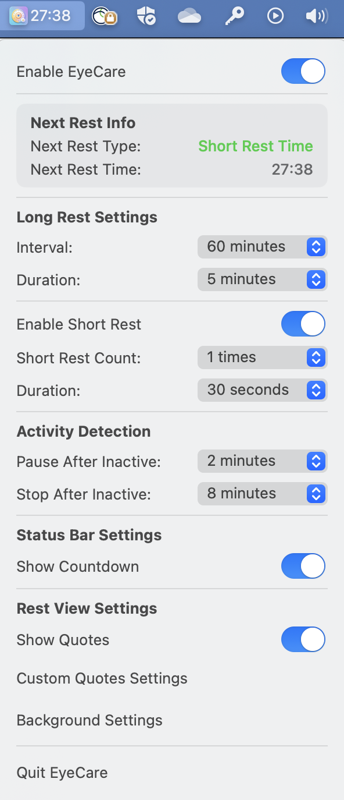
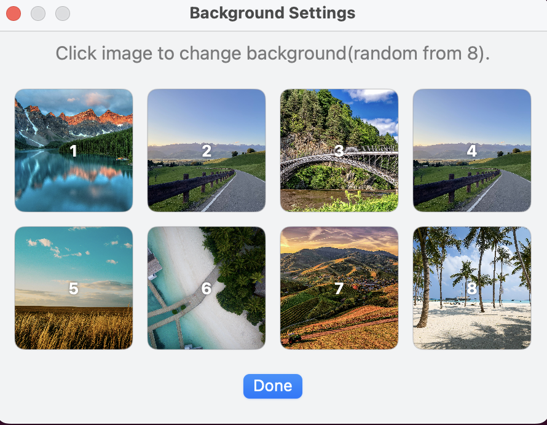

# Eye Care

Eye Care is a macOS application that helps you take regular breaks to protect your eyes and improve productivity.

## 🎯 Features

- **Long Rest Reminders**: Configurable intervals (30min, 45min, 60min, etc.) with customizable duration
- **Short Rest Integration**: Optional short breaks during long rest periods
- **Multi-Monitor Support**: Full-screen reminders on all connected displays
- **Smart Activity Detection**: Automatically pauses when you're away, stops after extended inactivity
- **Customizable Backgrounds**: Personalize rest views with your own images
- **Inspirational Quotes**: Motivational messages during rest periods
- **Progress Tracking**: Visual progress bar showing remaining rest time
- **System Integration**: Runs in the background with menubar icon

## 📸 Screenshots

### Menubar Interface

### Background Configuration

### Rest View

## 🚀 Installation

Since EyeCare is not from the Mac App Store and not signed with an Apple Developer ID, macOS may show “App cannot be opened because it is from an unidentified developer.”

1. Double-click **EyeCare.app** once (it will fail to open).
2. Open **System Settings → Privacy & Security**.
3. Scroll down to the **Security** section, and you’ll see a message:
   *“EyeCare was blocked because it is not from an identified developer.”*
4. Click **Allow Anyway**, then try to open the app again.
5. When prompted, confirm with **Open**.

## 🛠️ Configuration

### Basic Settings
- **Enable Eye Care Reminder**: Toggle the entire functionality on/off
- **Long Rest Interval**: Set how often you want long breaks (30-120 minutes)
- **Long Rest Duration**: Configure break length (1-10 minutes)

### Short Rest Settings
- **Enable Short Rest**: Toggle short break functionality
- **Short Rest Duration**: Set short break length (30s, 45s, 1min)
- **Count per Long Rest**: Number of short breaks during each long rest cycle (1-2 times)

### Activity Detection
- **Pause After Inactive**: Time before pausing reminders when idle (1-2 minutes)
- **Stop After Inactive**: Time before stopping reminders when away (3-8 minutes)

### Display Settings
- **Show Countdown**: Toggle menubar countdown display
- **Show Quotes**: Enable inspirational quotes during breaks
- **Custom Quotes**: Click to add your personalized inspirational quotes 
- **Custom Backgrounds**: Click to set personalized rest view backgrounds

## 📄 License

The software is provided under a BSD-3-Clause license

